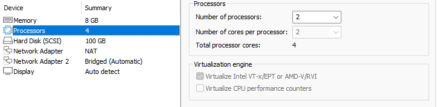
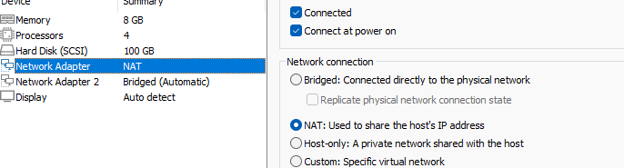
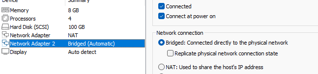
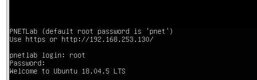
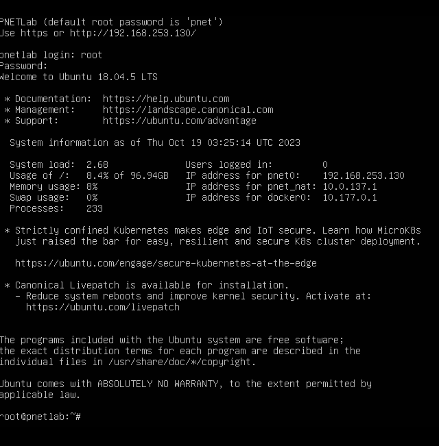
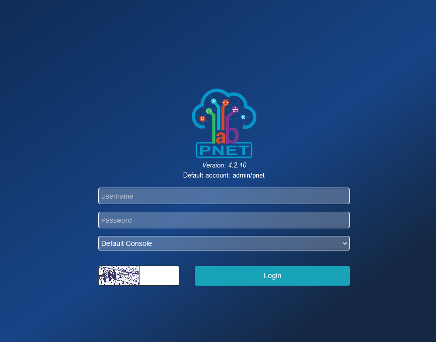
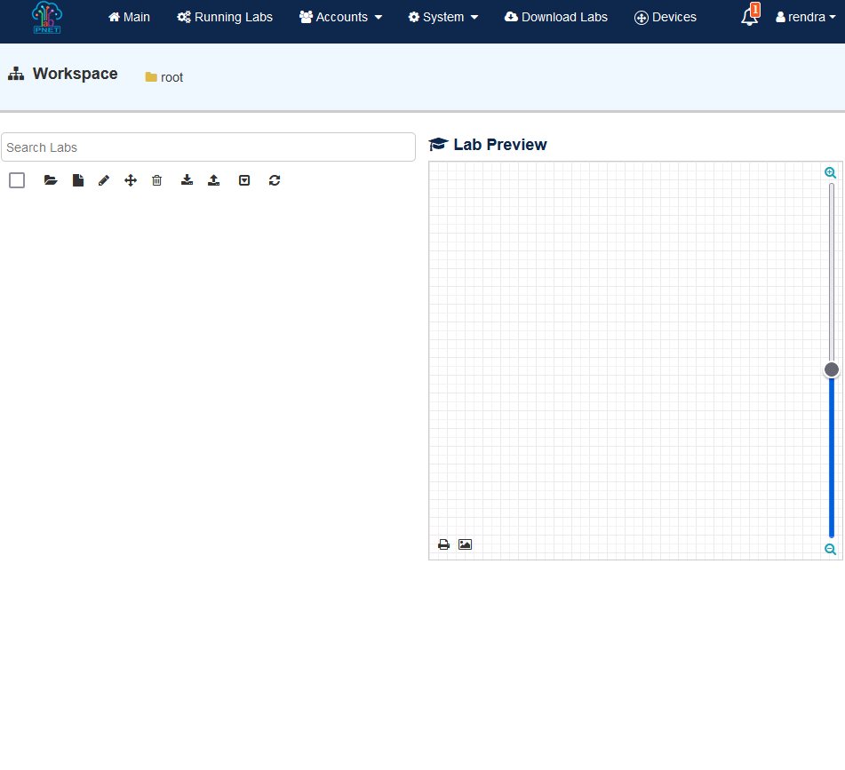
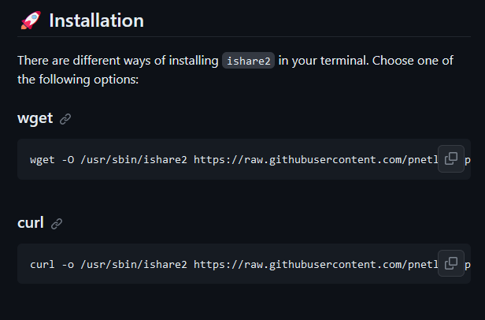
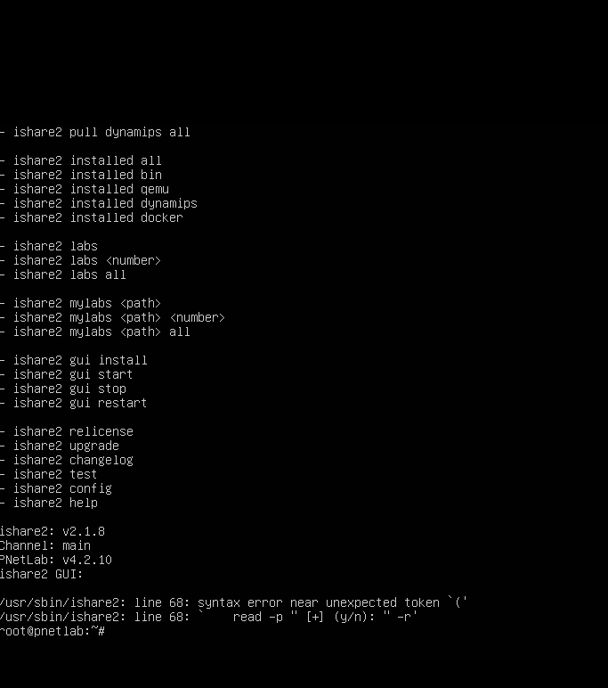

# PNETLAB Tutorial

## Download

## 1.Download PNETLab Dengan Link Dibawah :

[Download](https://pnetlab.com/pages/download){ .md-button .md-button--primary }


## Setting Interfaces
1.Setting virtual machine kalian seperti ini:



2.Jika sudah,atur network adapater nya seperti ini



3.Dan kalian jangan lupa untuk mengatur Network adapter 2 nya seoerti ini:



4.Kalo kalian sudah menyetting semua nya,maka tampilannya seperti ini



5.Masukan username `root`dan juga masukan `password` yang kalian sudah buat diawal tadi. dan tampilannya seperti ini



6.Oh iya kalau kalian ingin mengubah akun kalian,kalian bisa ikut cara ini

    1   .ketik https kalian yang ini di browser

```
https://192.168.253.130/store/public/auth/login/offline?link=https%3A%2F%2F192.168.253.130%2Fstore%2Fpublic%2Fadmin%2Fmain%2Fview&error=&success=
```


    2.jika sudah maka tampilannya akan seperti ini



    3   .dan jika kalian sudah login,maka tampilannya seperti ini


7.


## Setting ishare2

1.Kalian bisa download ishare2 nya dengan cara klik tombol dibawah

[Button](https://github.com/pnetlabrepo/ishare2){ .md-button .md-button--primary }

2.Kalian bisa scroll sampe bawah dan menemukan seperti ini



dan kalian bisa memilih 2 opsi ini

```
wget -O /usr/sbin/ishare2 https://raw.githubusercontent.com/pnetlabrepo/ishare2/main/ishare2 > /dev/null 2>&1 && chmod +x /usr/sbin/ishare2 && ishare2
```

```
curl -o /usr/sbin/ishare2 https://raw.githubusercontent.com/pnetlabrepo/ishare2/main/ishare2 > /dev/null 2>&1 && chmod +x /usr/sbin/ishare2 && ishare2\
```
3.Jika sudah dicopy,kalian bisa paste di PNET nya dan jadinya seperti ini




## Fix permission

## add router os


