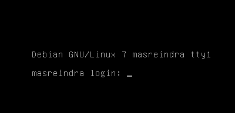
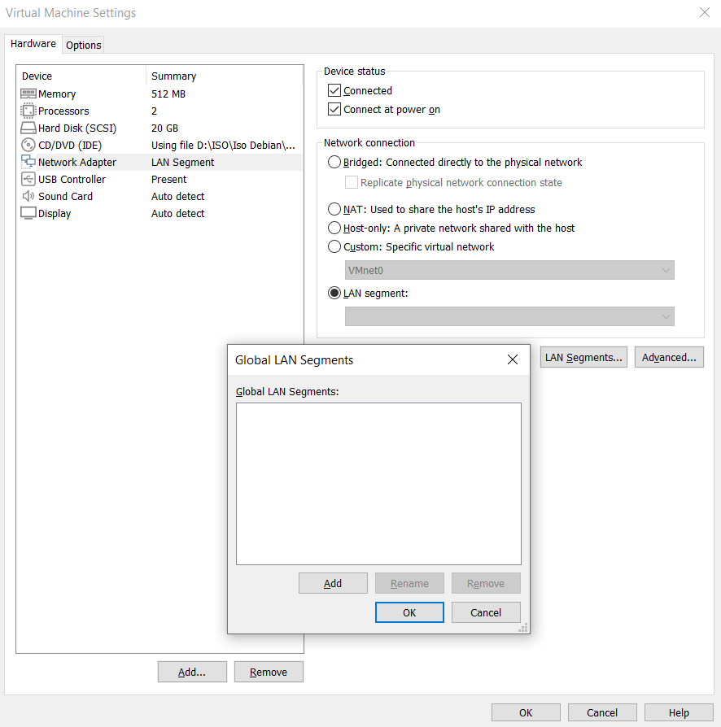
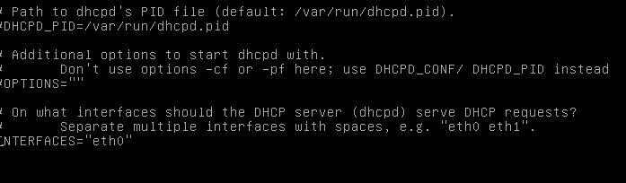
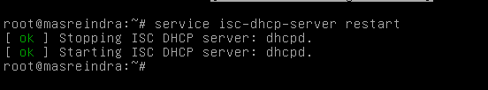
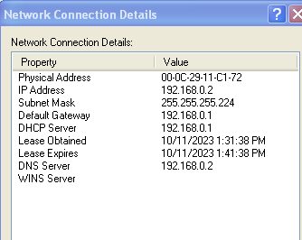

# Debian

## Tutorial Membuat Jaringan DHCP Server

## Chapter 1
 DEBIAN
        

apakah kalian tau cara menginstal DHCP?jika kalian tidak tau,saya akan tunjukin caranya. sebelum itu,kita mmenginstall 2 OS yang satu untuk ``server`` dan yang satu lagi untuk ``client``. 

saya menggunakan:

Debian 7 sebagai server

WinXP sebagai Client

nah teman teman, jika sudah menginstall OS Debiannya,maka yang perlu kita lakukan adalah login dan masukan password seperti digambar ini:



Setelah kalian berhasil menginstall OS yang dibutuhkan,kita perlu mengkonfigurasi ``server`` dan ``client`` dengan menggunakan VMware dengan cara 

1.Pilih setting dan kalian lakukan seperti digambar ini ya



Lakukan di kedua OS yang sudah kita install tadi


jika sudah,maka kita masuk langkah langkahnya:

### 1.install Server DHCP kalian

Buka Terminal dengan mengubah dari iso 1 ke iso 2 yang sudah diunduh oleh kalian dan jalankan perintah untuk menginstall DHCP Server:

    ```
    apt update
    apt install isc-dhcp-server
    ```

### 2.Konfigurasi ISC DHCP Server

setekah instalasi selesai,kalian harus mengatur server DHCP.tempat menyimpan DHCP nya tersebut  berada di /etc/dhcp/dhcpd.conf. kalian dapat mengubah atau mengedit file nya dengan menggunakan fungsi tersebut
```
nano /etc/dhcp/dhcpd.conf
```


untuk pengaturan nano nya,Anda harus menentukan subnet dan ip config yang diberikan oleh server DHCP. berikut contoh nya:

```
subnet 192.168.1.0 netmask 255.255.255.224{
    range 192.168.0.2 192.168.0.4;
    option domain-name-servers 192.168.0.2;
    option domain-name "debian.net";
    option routers 192.168.0.1;
    option broadcast-address 192.168.0.31;
    default-lease-time 600;
    max-lease-time 7200;
    }
```
### 3.Konfigurasi ethernet default

Kalian perlu mengubah interfaces nya dengan cara:

```
sudo nano /etc/default/isc-dhcp-server
```


### 4.Restart DHCP Server

setelah mengonfigurasi server DHCP,Restart layanan dengan perintah:

```
service isc-dhcp-server restart
```
sampai muncul seperti ini 




### 5.Uji coba hasil menggunakan xp


Terakhir,Anda dapat menguji server DHCP dengan menghubungkan perangkat ke jaringan dan memeriksa apakah mereka menerima alamat IP dari server DHCP.



Terimakasih telah membaca

### Note:Jika kalian menemui trouble yaitu tidak bisa menginstall mkdocs,kita bisa melakukan cara seperti ini

## ``install venv dan mkdocs dengan cara (python -m venv ven(pip install mkdocs) (pip install mkdocs-material)``
    